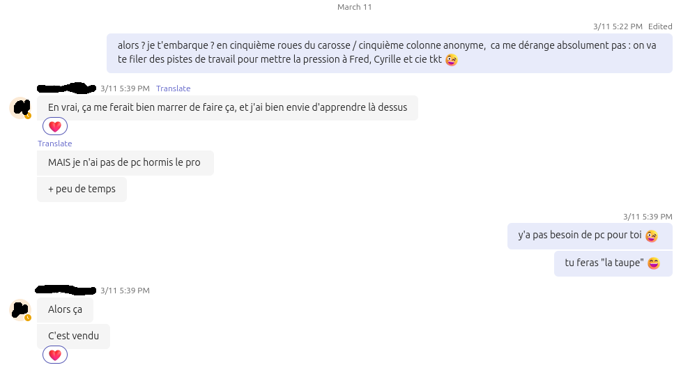

# Stéganographie sur les images présentes sur la machine

Alors là, y'a de quoi raconter et même s'il m'a bien frustré je le trouve à la fin marrant.

Je me faisais chambrer par le Grand Concepteur et notre Directeur Technique qui savaient que je galérais à trouver cette valeur. C'était la dernière, je commencais à partir dans toutes les directions dans un effet tunnel où je cherchais des vrais flags avec des vraies&trade; techniques de hacking !

Bref, j'ai même eu le droit à un indice supplémentaire : "Tu l'as sous les yeux mais tu ne le vois pas" et la seule réponse qui venait en tête était "mon nez"... c'est pour vous dire à quel point des fois on est irratrapable...

Donc j'ai sorti "The Weapon", la taupe qu'on avait embauchée depuis le début dans l'équipe pour du social engineering :D



En demandant gentiment par chat, j'ai recu la valeur: `FLAG9{f53d516fccde16e240fe3a62fa575c52fdc8cd7f}`. Je l'ai alors transmise à notre Très Cher DT (avec qui j'avais la chance d'être en physique): en lui disant "Tu vois j'ai la valeur". Il me demande "Comment tu l'as trouvé alors ?" et je réponds "Social Engineering".

J'ai eu droit au dégout alors qu'il s'agit clairement d'un des outils du pentester puis par pitié ou par supériorité manifeste, il m'a laché le morceau : "Mais c'était de la stégano, t'as rien écouté à mon meetup !" :D j'avais la valeur ET le mécanisme.


## StegExpose

https://github.com/b3dk7/StegExpose

```sh
mkdir images
find ../04-apache-80 -name "*.jpg" | xargs -I% cp % images/ 
java -jar StegExpose.jar images
```

nada

## Aperisolve

site chelou, je vais même pas plus loin.

## Stegseek

```sh
sudo apt install stegseek -y
stegseek images/target.jpg
```

```sh
StegSeek 0.6 - https://github.com/RickdeJager/StegSeek

[i] Found passphrase: ""
[i] Original filename: "super_secret_stuff.txt".
[i] Extracting to "target.jpg.out".
```

```sh
cat target.out.jpg
FLAG9{f53d516fccde16e240fe3a62fa575c52fdc8cd7f}
```

Twingo ! avec l'Art et la Manière !
